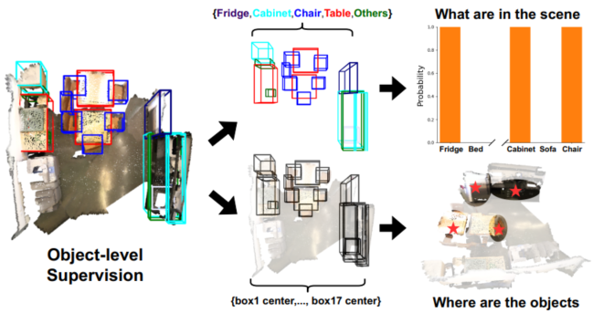
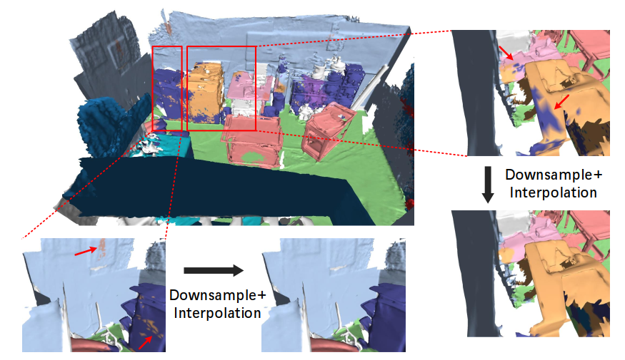
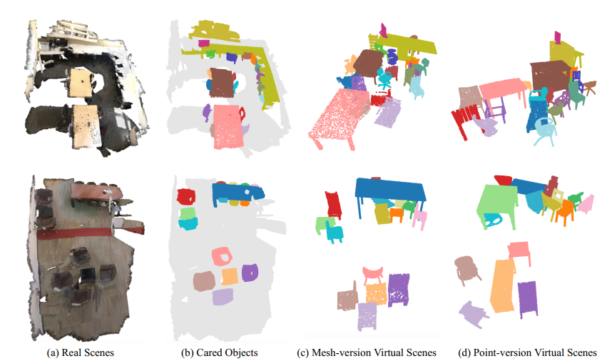

---
---

<h2>About Me</h2>
I am a 5th year Ph.D. candidate in the <a href="http://www.au.tsinghua.edu.cn/publish/auen/index.html"> Department 
of Automation</a> at <a href="https://www.tsinghua.edu.cn/publish/thu2018en/index.html"> Tsinghua University</a>, advised by 
Prof.<a href="https://www.au.tsinghua.edu.cn/info/1078/3126.htm"> Jie Zhou</a> and Prof.<a href="http://ivg.au.tsinghua.edu.cn/Jiwen_Lu/index.html/"> Jiwen Lu</a>. My recent 
research interests focus on <strong>3D vision</strong>, especially <strong>point cloud analysis</strong> and <strong>NeRF-based neural rendering</strong>. 

I am actively seeking a postdoctoral position, and if you are interested in my research area, please feel free to contact me!

 
<h2>Updates</h2>
<li><strong>[2023/11/18]</strong> 1 paper on 3D object detection accepted by <a href="https://ieeexplore.ieee.org/xpl/RecentIssue.jsp?punumber=34"> TPAMI</a>.</li>
<li><strong>[2022/08/29]</strong> 1 paper on point cloud segmentation accepted by <a href="https://ieeexplore.ieee.org/xpl/RecentIssue.jsp?punumber=83"> TIP</a>.</li>
<li><strong>[2022/03/02]</strong> 2 papers on indoor 3D object detection accepted by <a href="https://cvpr2022.thecvf.com/"> CVPR'22</a>.</li>
<li><strong>[2020/07/03]</strong> 1 paper on outdoor 3D object detection accepted by <a href="https://eccv2020.eu/"> ECCV'20</a>.</li>
<li><strong>[2019/06/05]</strong> I am honored with the Future Scholar Scholarship of Tsinghua University.</li>
<li><strong>[2019/02/25]</strong> 2 papers on point cloud recognition and instructional video analysis are accepted by <a href="http://cvpr2019.thecvf.com/"> CVPR'19</a>.</li>
 
<h2>Publications</h2>
<table class="pub_table">
<tbody>

 	<tr>
		<td class="pub_td1"></td>
        <td class="pub_td2"><u>Yu Zheng</u>, Yueqi Duan, Zongtai Li, Jie Zhou, Jiwen Lu <strong>Learning Dynamic Scene-conditioned 3D Object Detectors </strong> <i>IEEE Transactions on Pattern Analysis and Machine Intelligence (TPAMI)</i>, 2023, accepted. [<a href="https://yzheng97.github.io/">PDF</a>]
		</td>
	</tr>

	<tr>
		<td class="pub_td1"></td>
        <td class="pub_td2"><u>Yu Zheng</u>, Xiuwei Xu, Jie Zhou, Jiwen Lu <strong>PointRas: Uncertainty-Aware Multi-Resolution Learning for Point Cloud Segmentation. </strong> <i>IEEE Transactions on Image Processing (TIP)</i>, 2022, accepted. [<a href="https://ieeexplore.ieee.org/document/9892683">PDF</a>][<a href="https://github.com/yzheng97/PointRas/tree/main">Code</a>]
		</td>
	</tr>
 
	<tr>
		<td class="pub_td1"></td>
        <td class="pub_td2"><u>Yu Zheng</u>, Yueqi Duan, Jiwen Lu, Jie Zhou <strong>HyperDet3D: Learning a Scene-conditioned 3D Object Detector. </strong> <i>IEEE/CVF Conference on Computer Vision and Pattern Recognition (CVPR)</i>, 2022, accepted.  <strong>Oral Presentation</strong>
  [<a href="https://openaccess.thecvf.com/content/CVPR2022/papers/Zheng_HyperDet3D_Learning_a_Scene-Conditioned_3D_Object_Detector_CVPR_2022_paper.pdf">PDF</a>][<a href="https://openaccess.thecvf.com/content/CVPR2022/supplemental/Zheng_HyperDet3D_Learning_a_CVPR_2022_supplemental.pdf">Supp</a>][<a href="https://yzheng97.github.io/">Code</a>]
		</td>
	</tr>
	
	<tr>
		<td class="pub_td1"></td>
        <td class="pub_td2">Xiuwei Xu, Yifan Wang, <u>Yu Zheng</u>, Yongming Rao, Jiwen Lu, Jie Zhou <strong>Back to Reality: Weakly-supervised 3D Object Detection with Shape-guided Label Enhancement.</strong> <i>IEEE/CVF Conference on Computer Vision and Pattern Recognition (CVPR)</i>, 2022, accepted. [<a href="https://openaccess.thecvf.com/content/CVPR2022/papers/Xu_Back_to_Reality_Weakly-Supervised_3D_Object_Detection_With_Shape-Guided_Label_CVPR_2022_paper.pdf">PDF</a>][<a href="https://openaccess.thecvf.com/content/CVPR2022/supplemental/Xu_Back_to_Reality_CVPR_2022_supplemental.pdf">Supp</a>]
		</td>
	</tr>

	<tr>
		<td class="pub_td1"></td>
        <td class="pub_td2"><u>Yu Zheng</u>, Danyang Zhang, Sinan Xie, Jiwen Lu, Jie Zhou <strong>Rotation-robust Intersection over Union for 3D Object Detection.</strong> <i>European Conference on Computer Vision.</i>, 2020, accepted. [<a href="https://www.ecva.net/papers/eccv_2020/papers_ECCV/papers/123650460.pdf">PDF</a>][<a href="https://www.ecva.net/papers/eccv_2020/papers_ECCV/papers/123650460-supp.pdf">Supp</a>][<a href="docs/code/riou.py">Code</a>]
		</td>
	</tr>

    	<tr>
		<td class="pub_td1"></td>
        <td class="pub_td2">Yueqi Duan, <u>Yu Zheng</u>, Jiwen Lu, Jie Zhou, and Qi Tian <strong>Structural Relational Reasoning of Point Clouds.</strong> <i>IEEE/CVF Conference on Computer Vision and Pattern Recognition (CVPR)</i>, 2019, accepted. [<a href="docs/publications/SRN.pdf">PDF</a>][<a href="https://github.com/duanyq14/SRN">Code</a>]
		</td>
	</tr>
	
	<tr>
		<td class="pub_td1"></td>
        <td class="pub_td2">Yansong Tang, Dajun Ding, Yongming Rao, <u>Yu Zheng</u>, Danyang Zhang, Lili Zhao, Jiwen Lu, Jie Zhou <strong>COIN: A Large-scale Dataset for Comprehensive Instructional Video Analysis.</strong> <i>IEEE/CVF Conference on Computer Vision and Pattern Recognition (CVPR)</i>, 2019, accepted. [<a href="https://arxiv.org/abs/1903.02874">PDF</a>][<a href="https://openaccess.thecvf.com/content_CVPR_2019/supplemental/Tang_COIN_A_Large-Scale_CVPR_2019_supplemental.pdf">Supp</a>][<a href="https://coin-dataset.github.io/">Project Page</a>]

		</td>
	</tr>
</tbody>
</table>
                    
<h2>Services</h2>                          
<ul>
    <li><b>Reviewer</b>, CVPR, ECCV, ICME, ICIP, FG, etc. </li>
    <li><b>Reviewer</b>, TIP, TCSVT, PRL, etc.</li>
</ul>

<h2>My Interests</h2>                          
<ul>
    <li>I am a 8-year fan of soccer club <b>Atletico Madrid</b>. Aupa Atleti!</li>
    <li>I am keen on <b>Film photography</b>!</li>
</ul>

      
        
        
      

