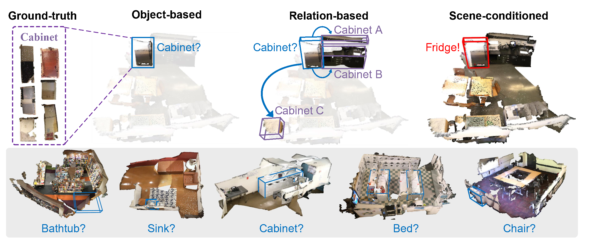
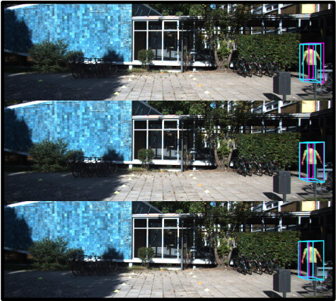
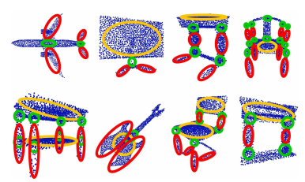
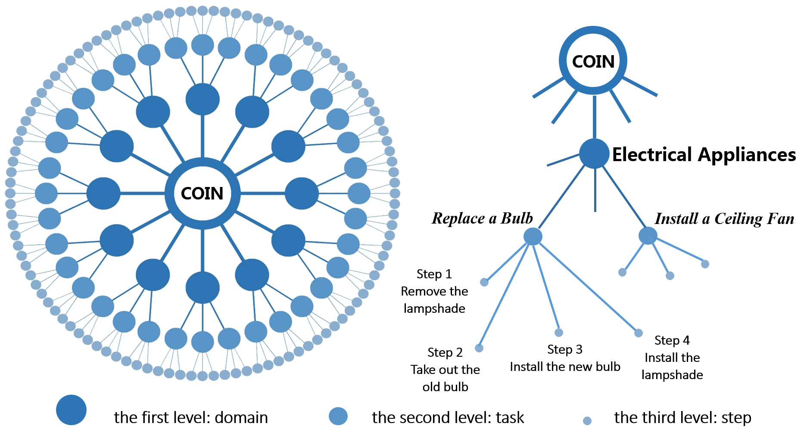

---
---

<h2>About Me</h2>
I am a 3rd year Ph.D. candidate in the <a href="http://www.au.tsinghua.edu.cn/publish/auen/index.html"> Department 
of Automation</a> at <a href="https://www.tsinghua.edu.cn/publish/thu2018en/index.html"> Tsinghua University</a>, advised by 
Prof.<a href="https://www.tsinghua.edu.cn/publish/auen/1713/2011/20110506105532098625469/20110506105532098625469_.html"> Jie Zhou</a> and Prof.<a href="http://ivg.au.tsinghua.edu.cn/Jiwen_Lu/"> Jiwen Lu</a>. My recent 
research interests focus on <strong>3D vision</strong> and <strong>complex activity analysis</strong>.
 
<h2>Updates</h2>
<li><strong>[2022/03/02]</strong> 2 papers on indoor 3D object detection accepted by <a href="https://cvpr2022.thecvf.com/"> CVPR'22</a>.</li>
<li><strong>[2020/07/03]</strong> 1 paper on outdoor 3D object detection accepted by <a href="https://eccv2020.eu/"> ECCV'20</a>.</li>
<li><strong>[2019/06/05]</strong> I am honored with the Future Scholar Scholarship of Tsinghua University.</li>
<li><strong>[2019/02/25]</strong> 2 papers on point cloud recognition and instructional video analysis are accepted by <a href="http://cvpr2019.thecvf.com/"> CVPR'19</a>.</li>
 
<h2>Publications</h2>
<table class="pub_table">
<tbody>

	<tr>
		<td class="pub_td1"></td>
        <td class="pub_td2"><u>Yu Zheng</u>, Yueqi Duan, Jiwen Lu, Jie Zhou <strong>Rotation-robust Intersection over Union for 3D Object Detection.</strong> <i>European Conference on Computer Vision (CVPR)</i>, 2022, accepted. [<a href="https://yzheng97.github.io/">PDF</a>][<a href="https://yzheng97.github.io/">Supp</a>][<a href="https://yzheng97.github.io/">Code</a>]
		</td>
	</tr>

	<tr>
		<td class="pub_td1"></td>
        <td class="pub_td2"><u>Yu Zheng</u>, Danyang Zhang, Sinan Xie, Jiwen Lu, Jie Zhou <strong>HyperDet3D: Learning a Scene-conditioned 3D Object Detector.</strong> <i>European Conference on Computer Vision (ECCV)</i>, 2020, accepted. [<a href="https://www.ecva.net/papers/eccv_2020/papers_ECCV/papers/123650460.pdf">PDF</a>][<a href="https://www.ecva.net/papers/eccv_2020/papers_ECCV/papers/123650460-supp.pdf">Supp</a>][<a href="docs/code/riou.py">Code</a>]
		</td>
	</tr>

    <tr>
		<td class="pub_td1"></td>
        <td class="pub_td2">Yueqi Duan, <u>Yu Zheng</u>, Jiwen Lu, Jie Zhou, and Qi Tian <strong>Structural Relational Reasoning of Point Clouds.</strong> <i>IEEE/CVF Conference on Computer Vision and Pattern Recognition (CVPR)</i>, 2019, accepted. [<a href="docs/publications/SRN.pdf">PDF</a>][<a href="https://github.com/duanyq14/SRN">Code</a>]
		</td>
	</tr>
	
	<tr>
		<td class="pub_td1"></td>
        <td class="pub_td2">Yansong Tang, Dajun Ding, Yongming Rao, <u>Yu Zheng</u>, Danyang Zhang, Lili Zhao, Jiwen Lu, Jie Zhou <strong>COIN: A Large-scale Dataset for Comprehensive Instructional Video Analysis.</strong> <i>IEEE/CVF Conference on Computer Vision and Pattern Recognition (CVPR)</i>, 2019, accepted. [<a href="https://arxiv.org/abs/1903.02874">PDF</a>][<a href="https://openaccess.thecvf.com/content_CVPR_2019/supplemental/Tang_COIN_A_Large-Scale_CVPR_2019_supplemental.pdf">Supp</a>][<a href="https://coin-dataset.github.io/">Project Page</a>]

		</td>
	</tr>
</tbody>
</table>
                    
<h2>Services</h2>                          
<ul>
    <li><b>Reviewer</b>, ICIP, 2019.</li>
    <li><b>Reviewer</b>, ICME, 2021.</li>
    <li><b>Reviewer</b>, TCSVT, PRL, etc.</li>
</ul>
